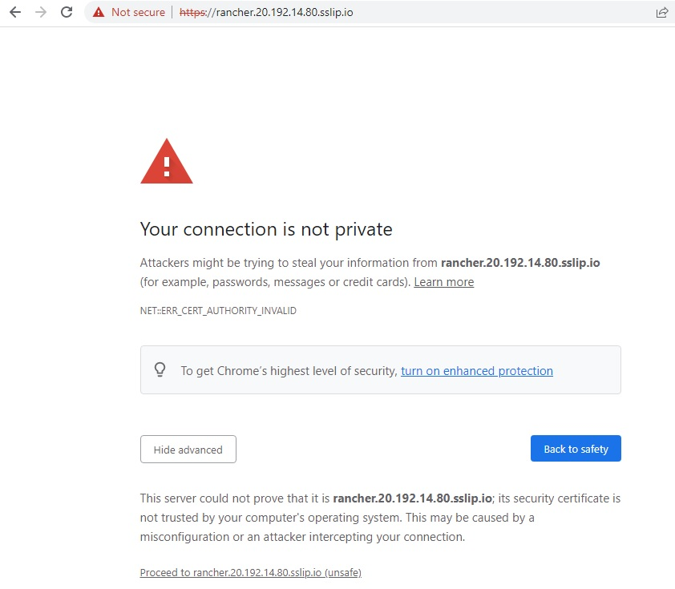

# Keycloak integration with Rancher

As a part the workshop we have pre-deployed SUSE Rancher Server, Keycloak and Elastic Search & Kibana for you.

The credentials for accessing Lab environment has been shared as web url link with you. 

You need to download the zip file and upon extraction you will find below 4 files.

1. keycloak.crt 
2. keycloak.pem
3. kube_config_server.yaml
4. lab-credentials    (**This file has got all your lab URL's and login credentials for Rancher, Keycloak and Elastic Search & Kibana**)

## Accessing SUSE Rancher server

Open lab-credentials file 

Look for keyword **"rancher_server_url"**, **"rancher_server_user"** and **"rancher_server_password"** 

Copy and past Rancher URL link in your favourite browser.

Rancher URL = **"rancher_server_url"**

user = **admin**

password = **"rancher_server_password"**

Since Rancher is built using self-signed certificated and it's not a valid certificate from authorized CA, your browser will give warning. You can safely click on link "Proceed to rancher-IP.sslip.io (unsafe)" to login.

Once you login, you will be at the Rancher Homepage, You should be able to see 3 Clusters which are pre-provisioned as part of the workshop.

### Getting familiar with Rancher UI

Navigate Home > Global Apps > Cluster Management > Clusters

You will all clusters in the cluster list.

For this workshop we are interested in User & Authentication.  Navigate to the section below

Home > Configuration > Users and Authentication

Under User & Authentication, you can view/create Users, Roles & Configure and Manage external Authentication Provider.  

Under Users, you will local admin for Rancher. Rancher provide a unique ID to the user for it's records.

To access list of available External Authentication providers click on Auth Provider. 

For this workshop we will be using **Keycloak OIDC**. 

Below is the configuration form page to the configure Keycloak with Rancher. 

We have completed our navigation for Rancher

## Accessing Keycloak Server

Open lab-credentials file 

Look for keyword **"keycloak_url"**, **"keycloak_admin_user"** and **"keycloak_admin_password"**

Copy and past Keycloak URL link in your favourite browser.

Keycloak URL = **"keycloak_url"**

user = **admin**

password = **keycloak_admin_password**

Since Keycloak is built using self-signed certificated and it's not a valid certificate from authorized CA, your browser will give warning. You can safely click on link "Proceed to rancher-IP.sslip.io (unsafe)" to login.

Click on Administration Console to login into Keycloak.

Provide the Keycloak credentials

Upon successful login, you will be presented below keycloak homepage

With this, we have successfully completed all required steps in Part 1. We are ready to move to the Part 2 [Exercise-2-Configure-Keycloak.md](./Exercise-2-Configure-Keycloak.md)

