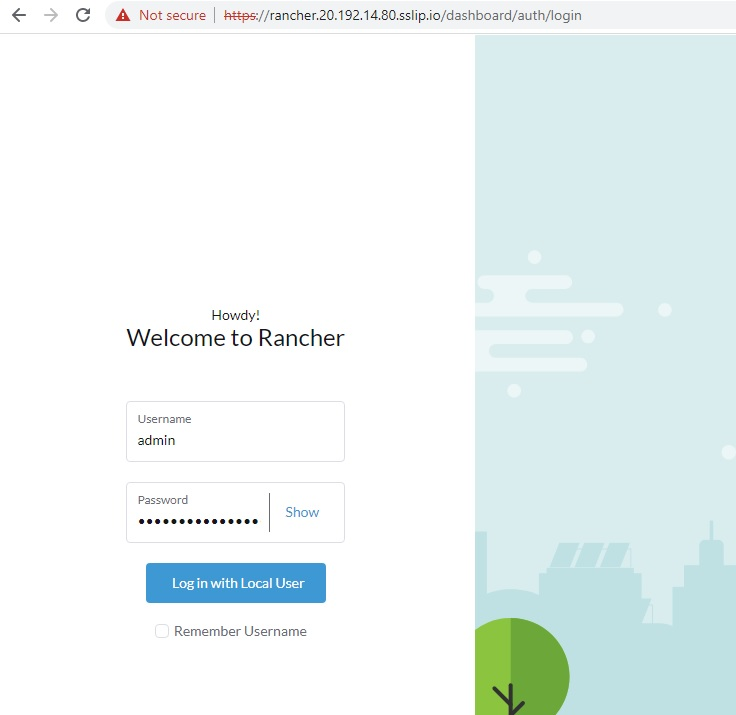

# Keycloak integration with Rancher

As a part the workshop we have deployed SUSE Rancher Server, Keycloak and EFK Stack for you.

The credentails for accessing above environemnt has been emailed to you on your registered email address which you have provided during workshop reistration.

## Accessing SUSE Rancher server

The url for accessing SUSE rancher is already shared over eamil, please copy and past in your favorite browser window.

Since Rancher is built using self-signed certificated and it's not a valid certificate from authorized CA, your browser will give warning. You can safely accept & process to login using the "Proceed to rancher IP.sslip.io (unsafe)"

Your Rancher credentials are email to you, so use the credential provided to login. 

Once you login, you will be at the Rancher Homepage, You should be able to see 3 Cluster which are pre-provisioned as part of the workshop.

For management of the cluster you can navigate to Global Apps > Cluster Management > Clusters

You will all cluster in the cluster list.

For this workshop we are instresed in User & Authentication.  To Navigate to the section where you can create & manage User, 

Home > Configuration > Users and Authentication

<Vijay> ---We need to add one picture to depict the user visible.  

TODO: Describe a scenario here.

## Solution architecture

Derek to provide the lab architecture.

1 VM - Rancher server (RKE2), Keycloak with persistent storage 

2 VM - Downstream RKE2 clusters (single node cluster)

3 VM - RKE2 HA cluster (3 nodes) running EFK stack 

All of the above environment will be pre-installed and made available for the workshop. The access  the workshop environment will be emailed to you on your registered email address for the workshop.

In this workshop we will help you integrating Keycloak as an external authentication provider with Rancher, we will demonstrate authentication and authorization. further we will also look at integration of EFK stack integration with Rancher.

  

This is what we are going to build in this workshop. We will create a resource group to contain the resources to be deployed in this workshop. Then, we will deploy �Rancher Server as a VM within this resource group. We will then configure the Rancher Server to automate the provisioning of Kubernetes (based on RKE2) into the same resource group but different subnets. We will then explore some management and application deployment features in Rancher.

This repository contains all the scripts and Kubernetes manifests for complimenting its hands-on workshop.

- [Part 1 - Initial Lab Setup on AWS Lightsail](./docs/part-1.md)
- [Part 2 - Configure GitHub & Jenkins](https://github.com/dsohk/rancher-devsecops-workshop/blob/main/docs/part-2.md)
- [Part 3 - Configure Jenkins Pipeline to deploy spring-petclinic App](https://github.com/dsohk/rancher-devsecops-workshop/blob/main/docs/part-3.md)
- [Part 4 - Rancher Continuous Delivery](https://github.com/dsohk/rancher-devsecops-workshop/blob/main/docs/part-4.md)
- [Part 5 - Put it all together](https://github.com/dsohk/rancher-devsecops-workshop/blob/main/docs/part-5.md)
- [Part 6 - Lab Clean Up](https://github.com/dsohk/rancher-devsecops-workshop/blob/main/docs/part-6.md)
- 

## Agenda

09:15 – 09:30 – Introduction (15 mins)

- Workshop Objectives
- 

09:30 – 9:45 - Keycloak integration with Rancher

- Configuring Keycloak

- Integration with Rancher

  

09:45 – 10:15 - Authentication & Authorisation

- Creating users in Keycloak
- User authentication
- Configure and Assign roles
- Authorisation

11:00 – 11:15 BREAK

11:15 – 12:15 – EFK (Elastic, FluentD and Kibana) integration with Rancher

- Configuring Kibana

- Configuring Rancher logging (FluentD)

- Log shipping to Elastic Search

- View logs in Kibana

- Report Generation

  

13:15 - 13:30 - Q&A

## Having trouble?

First, verify you have followed all written lab instructions (including the Before the Hands-on lab document).

Next, submit an issue with a detailed description of the problem.

Do not submit pull requests. Our content authors will make all changes and submit pull requests for approval.

If you are planning to present a workshop, review and test the materials early! We recommend at least two weeks prior.

Please allow 5 - 10 business days for review and resolution of issues.