# Keycloak integration with Rancher

In this **Exercise-5**, we will assign required Roles and Permission for Keycloak Groups

## **Rancher Role Assignment using RBAC**

By now we know that the Keycloak users have very little access to the Rancher platform

For the users to perform the tasks they would need adequate permissions

Rancher Roles are classified into 3 levels

Global Level Roles

Cluster Level Roles

Project Level Roles

## Assigning Global permission to Manage Rancher Platform

**superadmin** user is a regular user created in **keycloak**.

By default, Rancher assigns Standard User Role which allows him create and manage new clusters, however they will not be able to manage any other clusters as well as rancher management platform.

For him to manage Rancher management platform we need to elevate his permissions in Rancher and granting him global permissions of administrator.

Lets check the existing permissions **superadmin** user have in Rancher and elevate him to permissions of administrator.

login as "**admin**" user using **Log in with Keycloak** option and using the credentials as set during Exercise-4.

Navigate to Home > Configuration > Users & Authentication > Users

Click on the checkbox of **superadmin** user and click on 3 vertical dots and click **Edit Config**

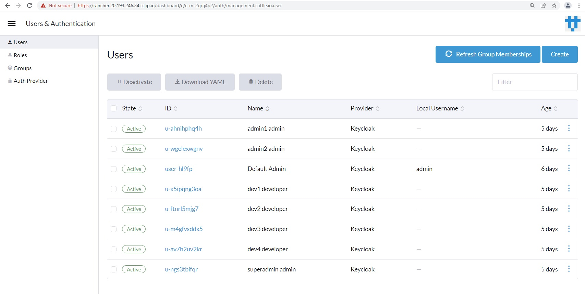

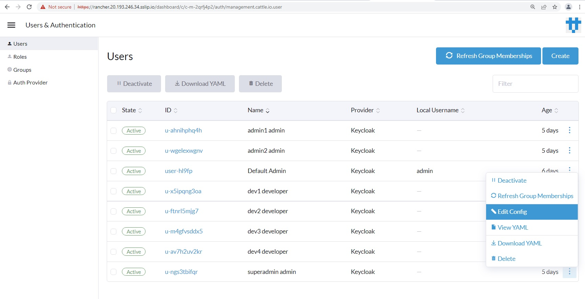

The default Global Permissions are set to **Standard User**

We need to elevate his access to higher level to **"Administrator"** which has full permissions at the Rancher platform level and Downstream clusters.

Select "**Administrator**" and click **Save**

Re-login to Rancher UI using Keycloak option

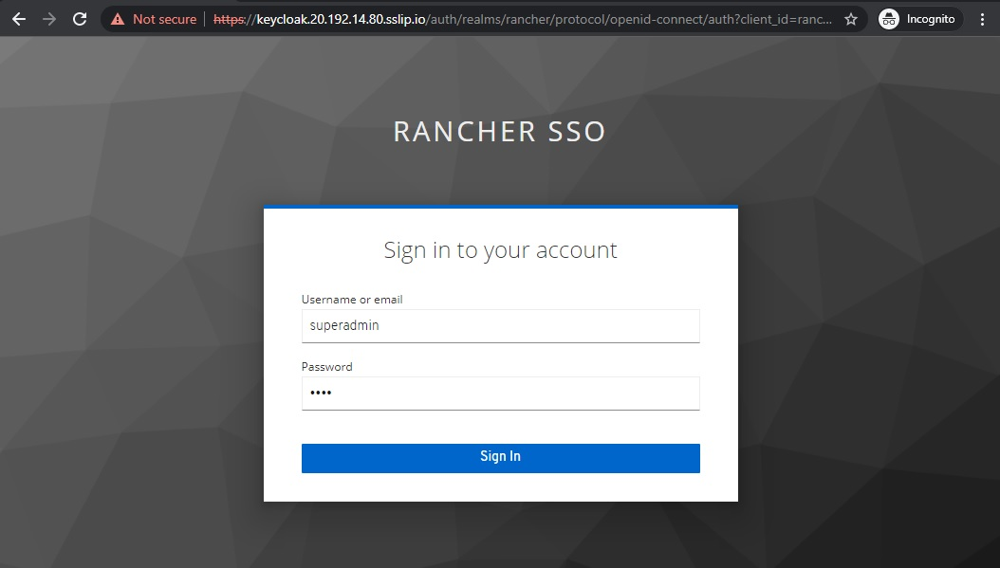

Now you can see more options such as Continuous Delivery, Cluster Manager etc and all the downstream clusters

## Assigning Cluster level permission to Manage individual clusters

Based on Organization structure we have 3 admins and 4 developers.
In the previous step we have elevated **superadmin** user to manage Rancher platform and all downstream cluster.
Now we have to explicitly assign the rest of the 2 admins to manage their own respective cluster.

In order to grant them explicit permissions to respective clusters we will need to grant user a cluster level permissions.

Now, we will now grant user "**admin1**" user as "**Cluster Owner**" role, so that **admin1** user can have full control of the cluster and all its resources.

login as "**admin**" user using **Log in with Keycloak** option and using the credentials as set during **Exercise-4.**

Home > Explore CLUSTER > select "rke2-cluster1"

rke2-cluster1 > RBAC > select Cluster Members

Click **Add** button

Click on **Select Member** and type "**cluster-admin-group1**"

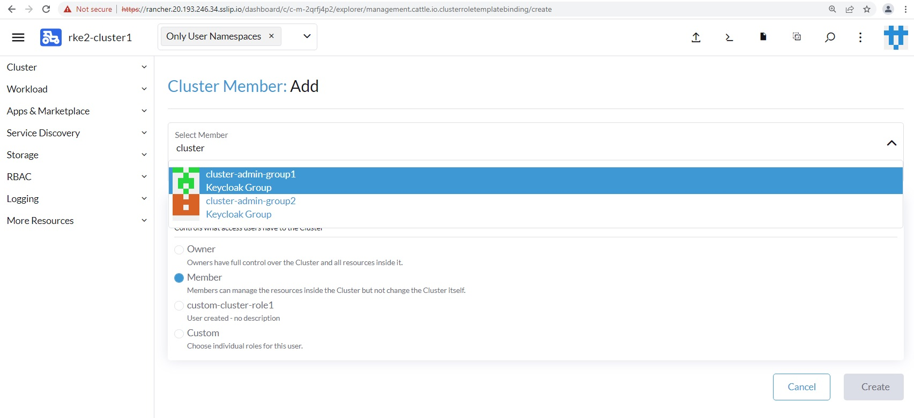

Select **Cluster Permissions** as "**Owner**"

Click on **Create** button

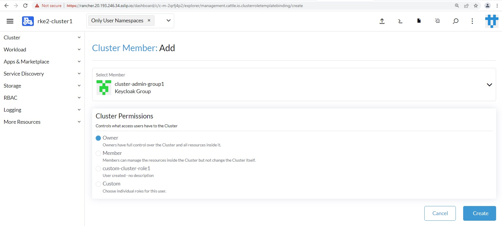

You can notice Group "**cluster-admin-group1**" added as **Cluster Owner**

Logout from **admin** user from Rancher UI

Now, Lets validate access rights/permissions by login as "**admin1**" user on the **Rancher UI**

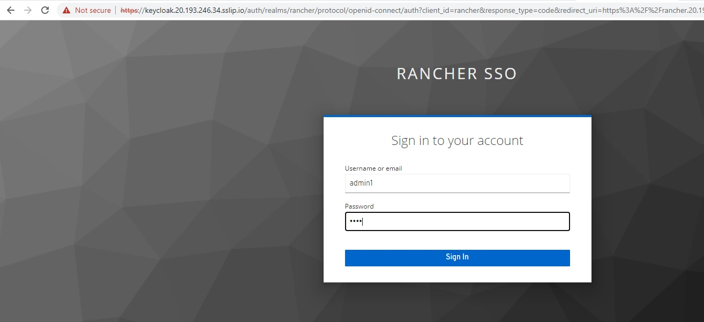

Now we can see **rke2-cluster1** only under Explore Cluster option

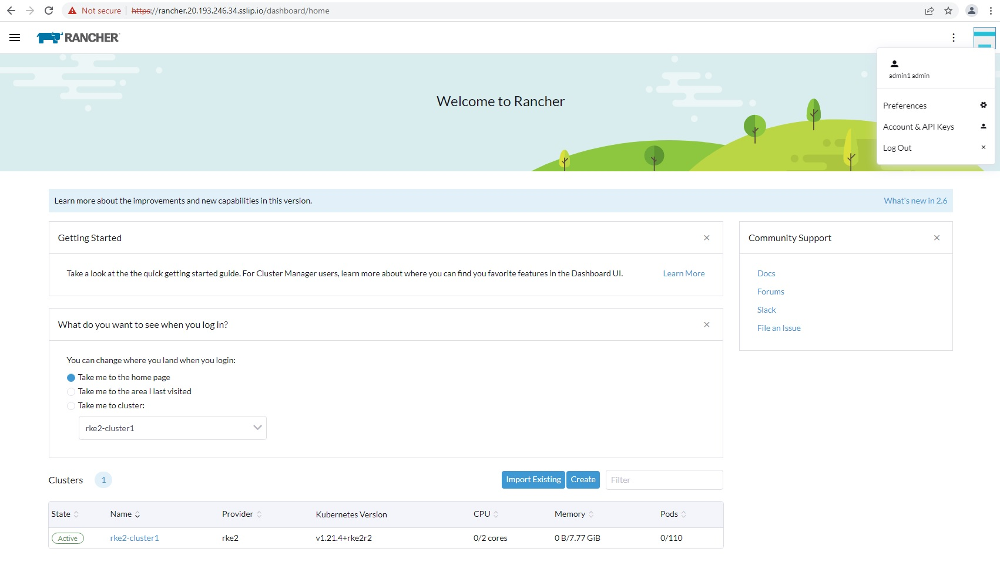

Apps and Market place are only accessible to cluster owners

We have successfully assigned user "admin1" user to manage cluster "rke2-cluster1"

Similarly you can repeat the above steps for user "admin2" for cluster "rke2-cluster2".

So for we have configured role and permissions for cluster administrators, in the next step we will have developers access to their respective projects /namespaces. 

## Manage Project/Namespaces

In the development team we have mix of senior and junior developers. The senior developers because of their role and experience are granted rights to create projects and namespaces. Junior developers are restricted to create namespaces only for their own development work.

Till now we have used default built-in roles and permissions, lets explore ways to create custom roles and permissions to meet very specific needs.

**dev1** user will be assigned as built-in cluster member role as well as a custom role to create and manage projects and namespaces.

**dev2** user will be assigned custom role only to create and manage namespaces in existing projects.

**dev2** user is not allowed to create any new projects.

### Create Custom Project Role

login as "**admin**" user using **Log in with Keycloak** option and using the credentials as set during **Exercise-4.**

Home >  Users & Authentication > Roles > Project/Namespaces 

Click on **Create Project /Namespaces Role**

Name = **"custom-project-role1"**

Under Grant Resources > Verbs > add below

create

delete

get

list

patch

update

watch

Resource = **"Namespaces"** (from dropdown)

In the previous step we have created custom project/namespace role. It cannot be assigned to users directly. They have to be first associated to custom cluster role and thereafter to the user. 

Next step is to create, custom cluster role

Home >  Users & Authentication > Roles > Cluster 

Click on **Create Cluster Role**

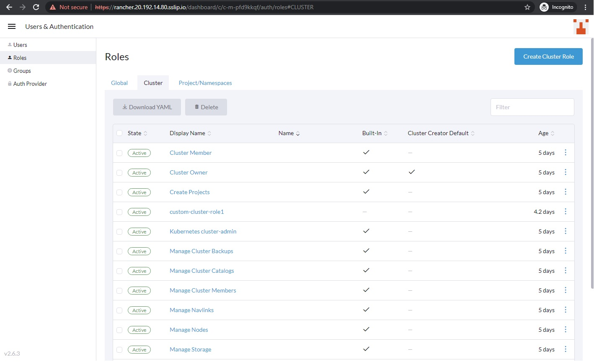

Name = **"custom-cluster-role1"**

Under Inherit From tab> select custom-project-role "**custom-project-role1**"

Keep default options under **Grant Resources** and click on **Create**

Logout from **admin** user

login as "**admin1**" user using **Log in with Keycloak** option and using the credentials as set during **Exercise-4.**

Home> Explore Cluster > rke2-cluster1 > RBAC > Cluster Members 

Click **Add**

Under Select Members dropdown option, select user "**dev1**"

Under **Cluster Permissions** > 

select "**Member**"  and click on **Create**

To add and manage namespace explicitly the way we wanted using the custom role, we will now assign cluster permissions "**custom-cluster-role1**" and click **Create**

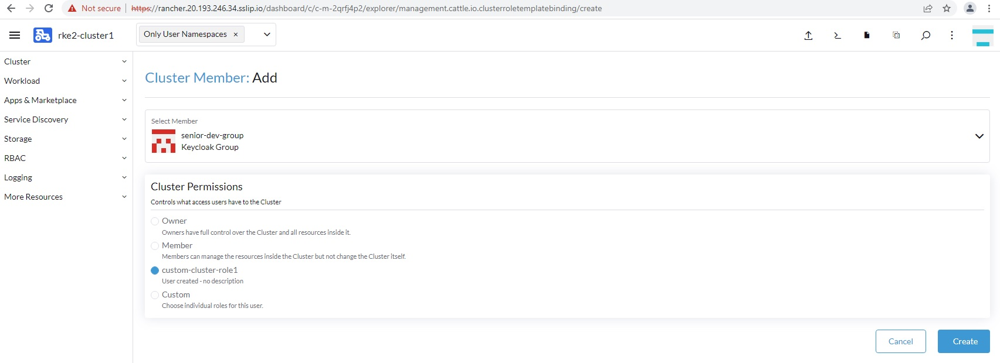

Logout from **admin**1 user

login as "**dev1**" user using **Log in with Keycloak** option and using the credentials as set during **Exercise-4.** 

You can notice **dev1** user has both create Project and create Namespace option

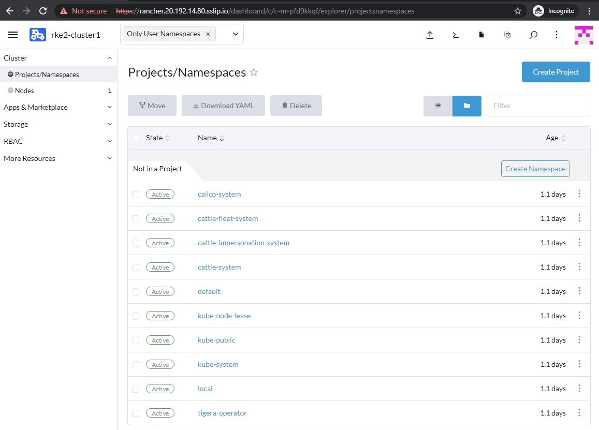

Create **New Project**

Home > Explore Cluster > rke2-cluster1> Projects/Namesapces 

Click on **Create Project**

Name = **dev1-user-project1**

Under Project/Namespaces > **"dev1-user-project1"** 

Click on **Create Namespace**

Logout from **dev1** user

login as "**admin1**" user using **Log in with Keycloak** option and using the credentials as set during **Exercise-4.** 

Home> Explore Cluster > rke2-cluster1 > RBAC > Cluster Members

Click **Add**

Under Select Members dropdown option, select user "**dev2**"

Under Cluster Permissions > select "**custom-cluster-role1**"  and click on Create 

Here, We have granted him custom cluster role only

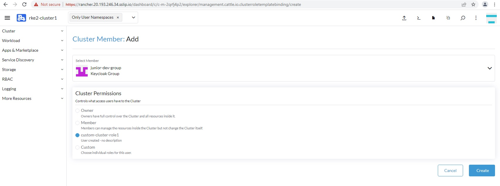

Since we need to give him access to view project level view, so we assign built-in  additional custom role "view all projects" and click create

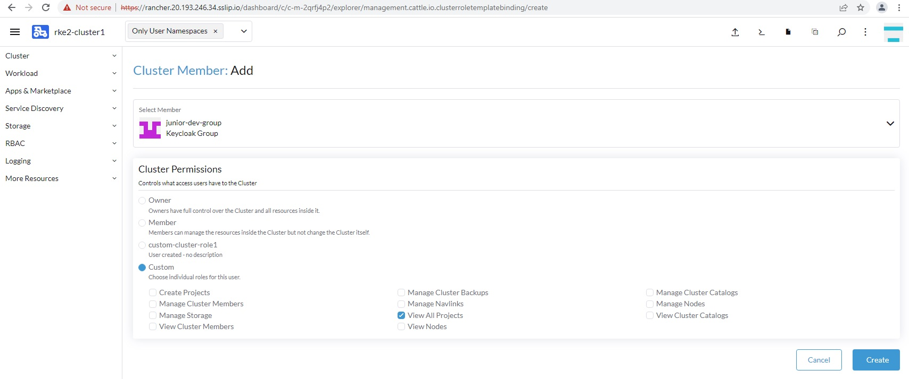

Finally we have assigned all built-in and custom roles for users "dev1" and "dev2"

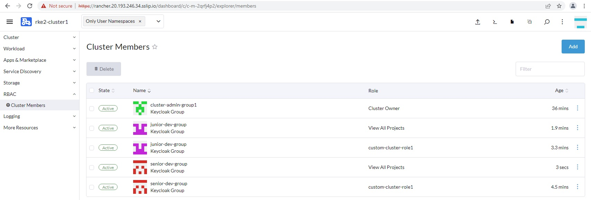

Logout from **admin1** user

login as "**dev2**" user using **Log in with Keycloak** option and using the credentials as set during **Exercise-4.** 

You can notice **dev2** user doesn't have option for creating new projects, but create new namespace in the existing Projects.

With this, we have successfully completed all required steps in **Exercise 5: "Rancher role assignment and RBAC"**. 

We are now ready to move to the **Exercise 6: [Exercise 6: Configure Rancher Logging](./Exercise-6-Configure-Rancher-Logging.md)**
