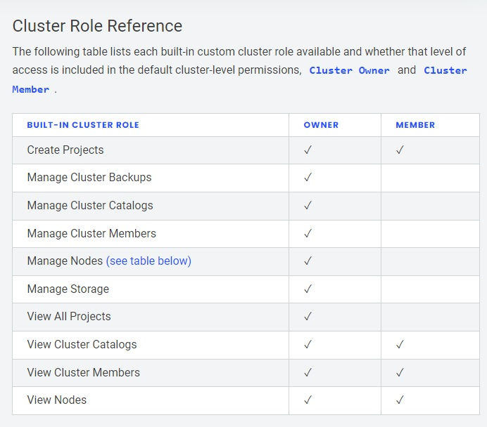
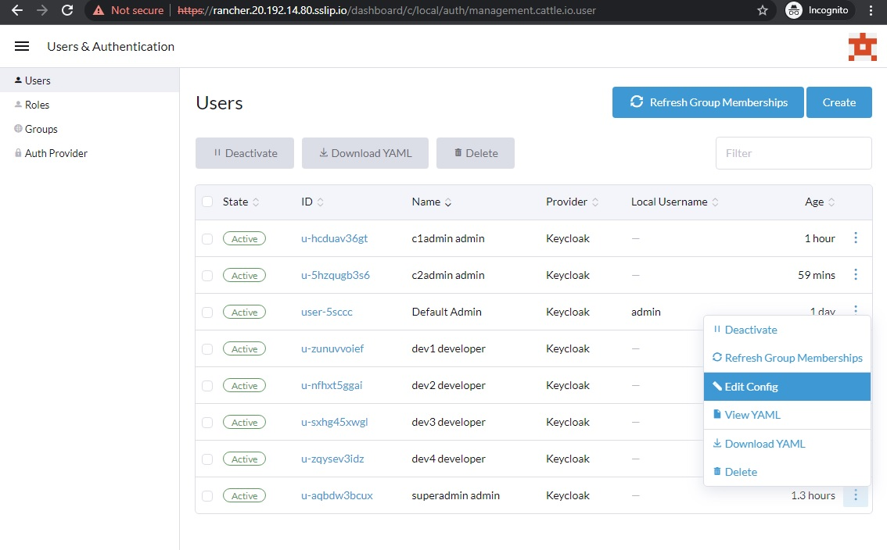
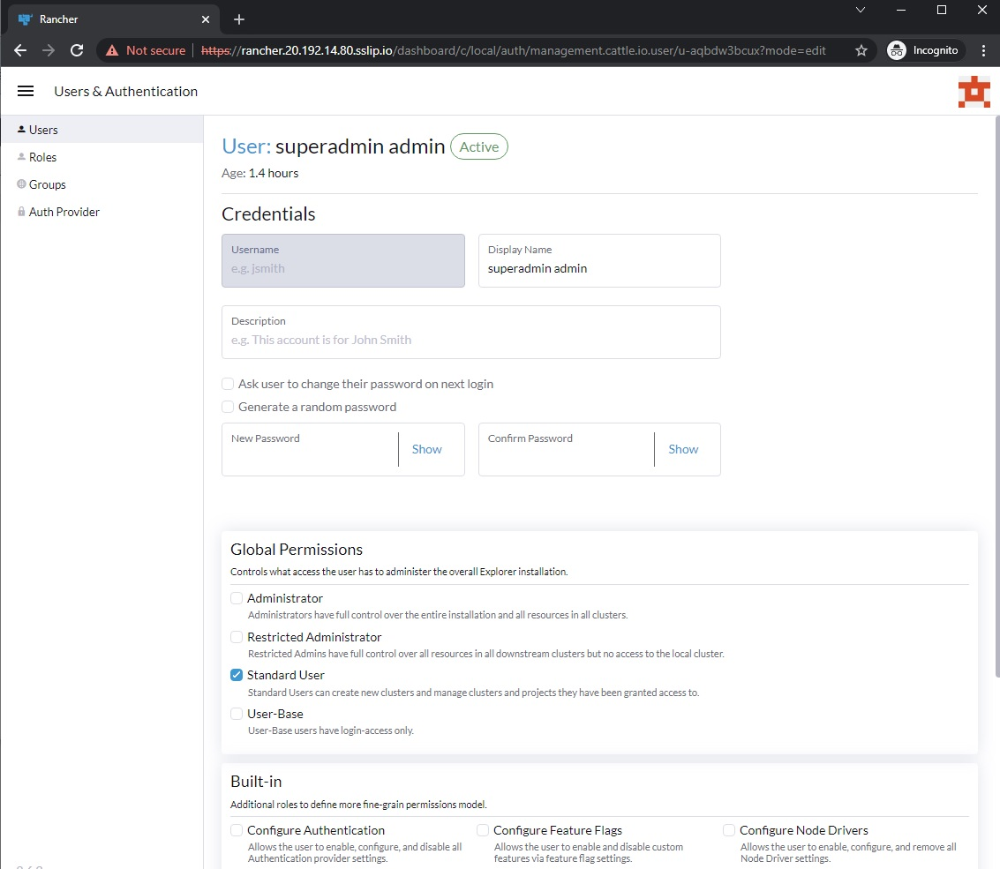
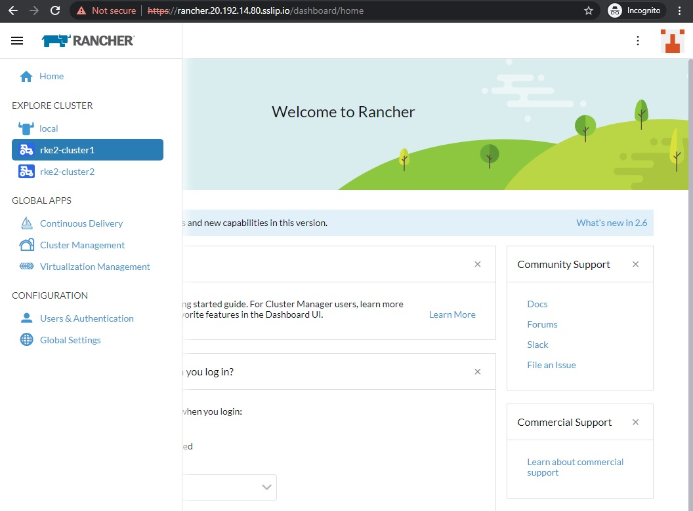
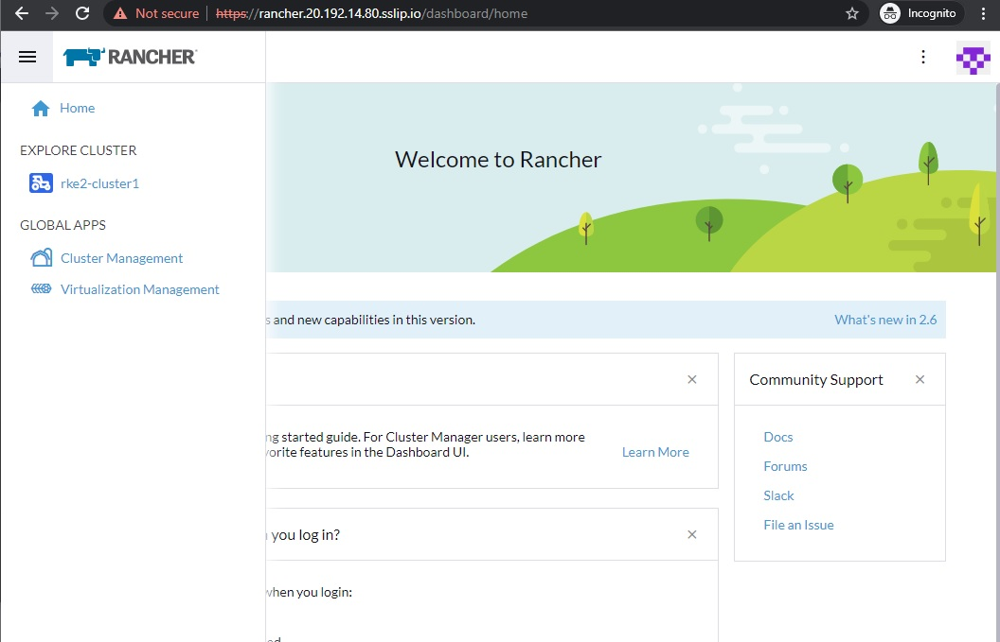
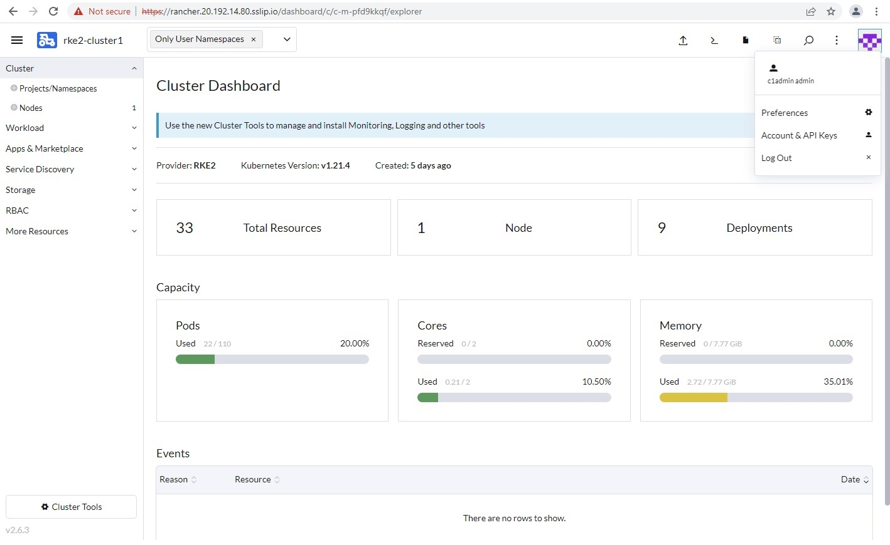
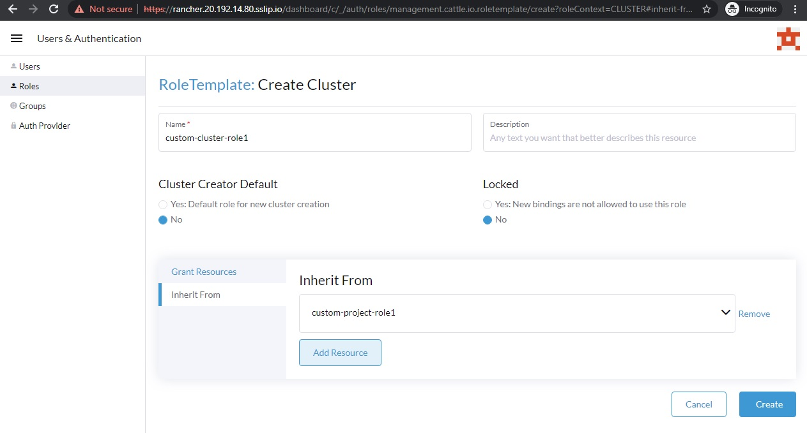
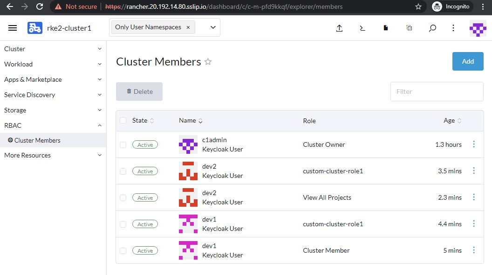
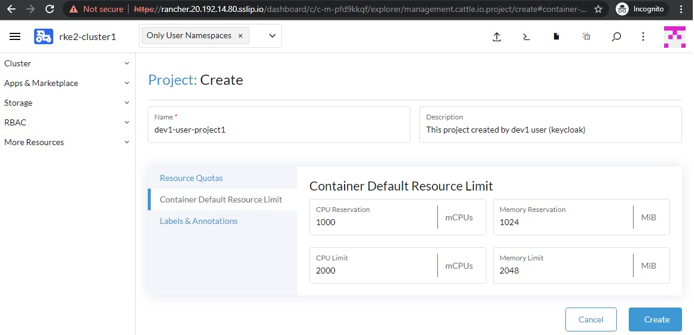
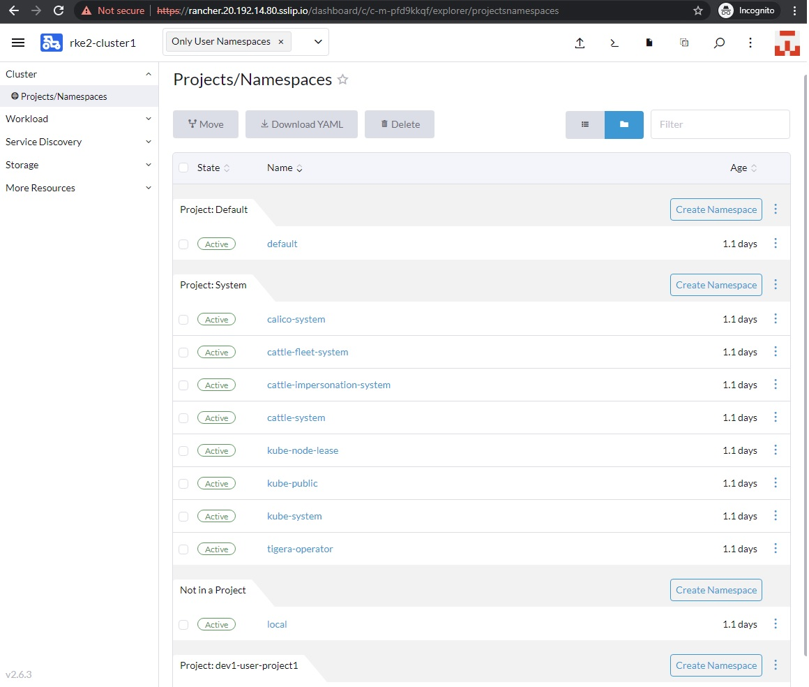

# Keycloak integration with Rancher

As a part the workshop we have deployed SUSE Rancher Server, Keycloak and EFK Stack for you.

The credentails for accessing above environemnt has been emailed to you on your registered email address which you have provided during workshop reistration.

## Rancher Role Assignment and RBAC

By now we know that the Keycloak users have very little access to the Rancher platform

For the users to perform the tasks they would need adequate permissions

<<<<<<<, to be update from documentation

## Assigning Global permission to Manage Rancher Platform

superadmin user is a regular user created in keycloak.

By default, Rancher assigns Standard User Role which allows him create and manage new clusters, however they will not be able to manage any other clusters as well as rancher management platform.

For him to manage Rancher management platform we need to elevate his permissions in Rancher and granting him global permissions of administrator.

Lets check the existing permissions superadmin user have in Rancher and elevate him to permissions of administrator.

login as "admin" user using Keycloak option and using the credentials as set during Excercise-2.

Navigate to Home > Configuration > Users & Authentication > Users

Click on the checkbox of superadmin user and click on 3 vertical dots and click Edit Config

<<<<<<<<<< highligh below image

The default Global Permissions are set to Standard User

We need to elevate his access to higher level to "Administrator" which has full permissions at the Rancher platform level and Downstream clusters.

Select "Administrator" and click Save

Re-login to Rancher UI using Keycloak option

Now you can see more options such as Continuous Delivery, Cluster Manager etc and all the downstream clusters

## Assigning Cluster level permission to Manage individual clusters

For the workshop we have pre-deployed 3 clusters in all.
Based on Organization structure we have 3 admins and 4 developers.
In the previous step we have elevated superadmin user to manage Rancher platform and all downstream cluster.
Now we have to explicitly assign the rest of the 2 admins to manage their own respective cluster.

In order to grant them explicit permissions to respective clusters we will need to grant user a cluster level permissions.

Now, we will now grant user "c1admin", role "Cluster Owner" in order to have full control of the cluster and all its resources.

Home > Explore CLUSTER > select "rke2-cluster1"

rke2-cluster1 > RBAC > select Cluster Members

Click Add button to add Cluster Members

Select "Owner" as the desired Cluster Permission and click "Create"

Upon success, we can now see user "c1admin" now has the role "Cluster Owner"

Lets validate by login as "c1admin" user on the Rancher UI

Now we can see rke2-cluster1 under Explore Cluster option

Apps and Market place are only accessible to cluster owners

We have successfully assigned user "c1admin" to manage cluster "rke2-cluster1"

Similarly you can repeat the above steps for user "c2admin" for cluster "rke2-cluster2".

With this, we have successfully completed integration of Keycloak with Rancher and successfully demonstrated Rancher Roles assignments and RBAC.

In the next section we will showcase EFK stack integration with SUSE Rancher.

