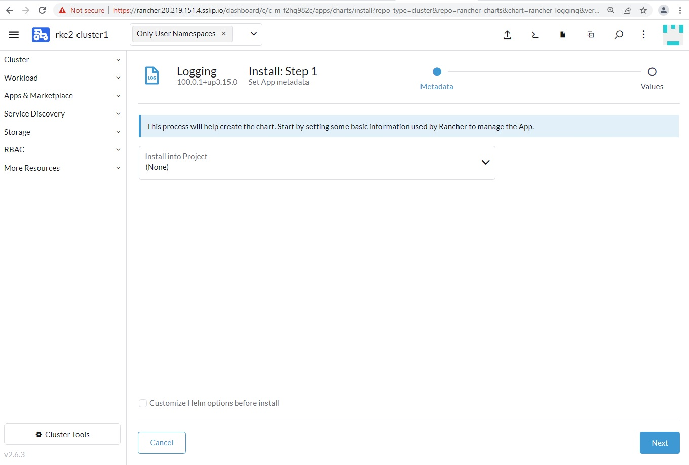
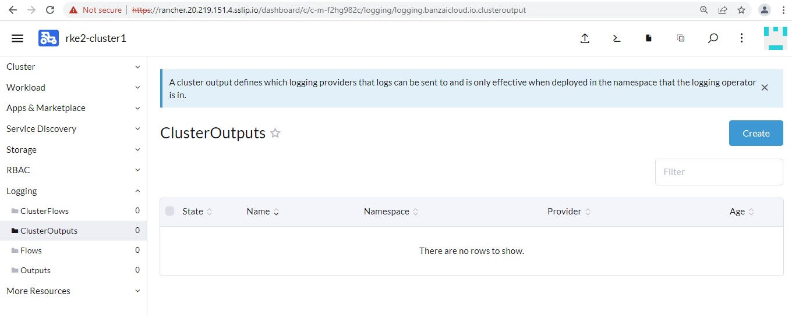
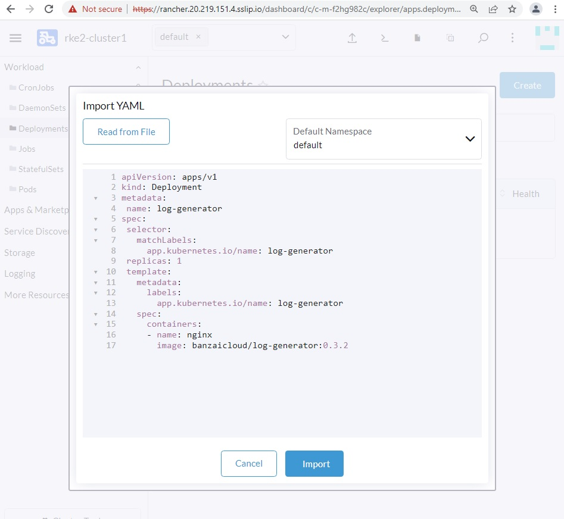
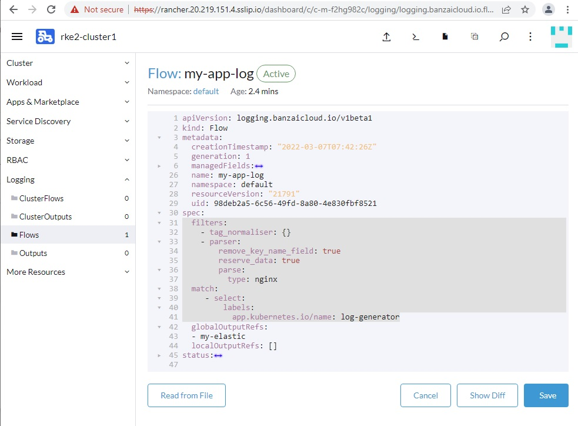

# EFK stack integration with Rancher


As a part the workshop we have deployed SUSE Rancher Server, Keycloak and EFK Stack for you.

The credentails for accessing above environemnt has been emailed to you on your registered email address which you have provided during workshop reistration.


## Rancher Logging using EFK Stack


Lets verify the if Elastic search engine is up and running, view the elastic search URL and login with "elastic" user and credentials


Now lets verify the if Kibana service dashboard is up and running, view the kibana  URL and login with "elastic" user and credentials








Copy the below lines under spec: section, as depicted in the image below


```
    ssl_verify: false
    ssl_version: TLSv1_2
```


Copy the below lines under spec: section, as depicted in the image below

```
    include_timestamp: true
    buffer:
      timekey: 1m
      timekey_wait: 30s
      timekey_use_utc: true
```





Copy the below lines under spec: section, as depicted in the image below

```
  filters:
    - tag_normaliser: {}
    - parser:
        remove_key_name_field: true
        reserve_data: true
        parse:
          type: nginx
  match:
     - select:
         labels:
           app.kubernetes.io/name: log-generator
```





With this, we have successfully completed integration of Keycloak with Rancher and successfully demonstrated Rancher Roles assignments and RBAC.

In the next section we will showcase EFK stack integration with SUSE Rancher.


