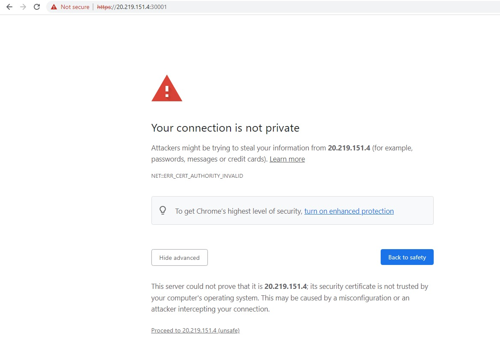
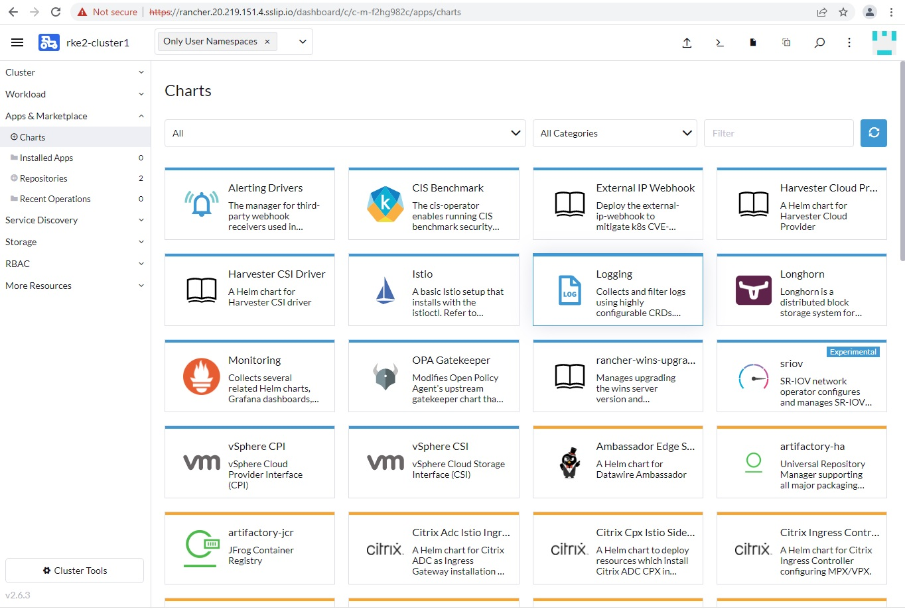
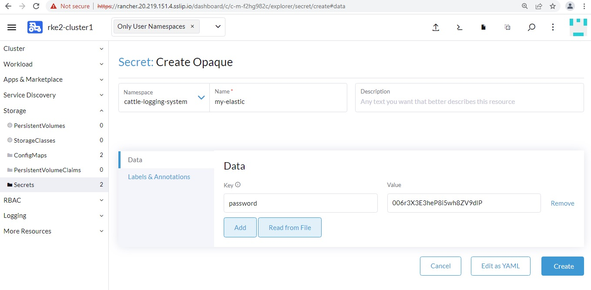
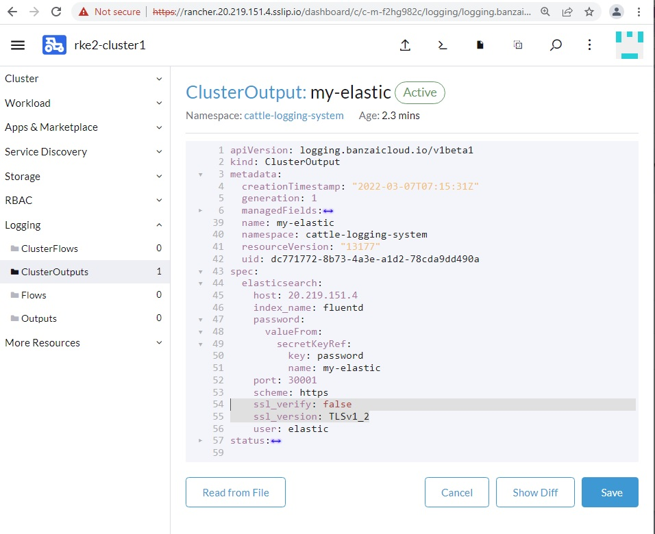
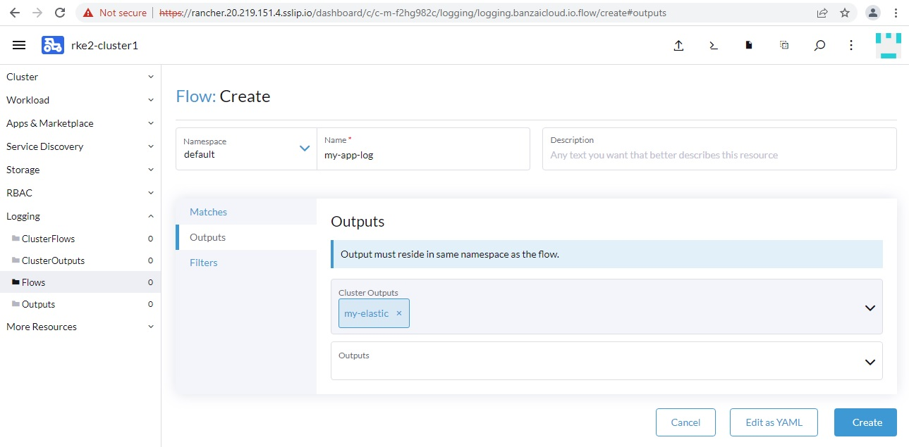
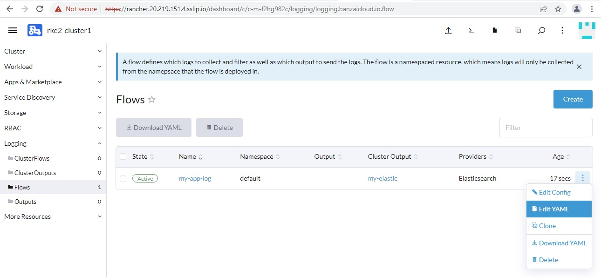

## Rancher Logging using EFK Stack

### Connecting to Elastic Search

Lets verify the if Elastic search engine is up and running, view the elastic search URL and login with "elastic" user and credentials



Provide login credentials

User = elastic

Password = < shared >


The above details in the browser confirms Elastic search services are up and running.

### Connecting to Kibana Dashboard

Now lets verify the if Kibana service dashboard is available, view the Kibana URL


login = elastic

Password = < Shared >


Click on "Explore on my own"


Next step is to deploy Rancher logging

### Deploying Rancher Logging

Home > Explore Cluster > rke2-cluster1 > App & Marketplace > Charts > Logging



Click on Install


Continue with default options and click on Next


Continue with default options and click on "Install"


Logging deployed successfully as depicted in the image below


Upon successful provisioning of Rancher Logging, you will see logging option available, upon expanding you will find four options. 

1. ClusterFlows

2. ClusterOutputs

3. Flows

4. Outputs


#### Configure Secrets

Prior to configuring cluster output, lets configure secrets which would be required during cluster output configuration

Home > Explore Cluster > rke2-cluster1 > Storage > Secrets > Create


Select "Opaque" option


Use below options to populate the form

Namespace = cattle-logging-system

Name = my-elastic

Key = password

Value = < Elastic User Password Shared >



#### Configure Cluster Outputs

Home > Explore Cluster > rke2-cluster1 > Logging > ClusterOutputs > Create


Select from dropdown

Output = Elasticsearch


Target

Scheme = https

Host = < elastic server IP address >

Index Name = fluentd

Access 

User = elastic

Secret Key from Secret = my-elastic (from the dropdown)

key = password  (from the dropdown)

Click on Create


Hit 3 vertical dots to Edit YAML


Copy the below lines under **"spec:"** section, as depicted in the image below

```
    ssl_verify: false
    ssl_version: TLSv1_2
```



Copy the below lines under **"spec:"** section, as depicted in the image below

```
    include_timestamp: true
    buffer:
      timekey: 1m
      timekey_wait: 30s
      timekey_use_utc: true
```


Final ClusterOutputs should look as below


We have configured the cluster level output for rke2-cluster1 to Elastic Search

#### Deploy Sample App - Log Generator

Now we will deploy sample application which will generate continuous logs and we will forward these logs to Elastic Search

Home > Explore Cluster > rke2-cluster1 >Workload > Deployments > Create


#### Configure Flows








Copy the below lines under spec: section, as depicted in the image below

```
  filters:
    - tag_normaliser: {}
    - parser:
        remove_key_name_field: true
        reserve_data: true
        parse:
          type: nginx
  match:
     - select:
         labels:
           app.kubernetes.io/name: log-generator
```


With this, we have successfully completed integration of Keycloak with Rancher and successfully demonstrated Rancher Roles assignments and RBAC.

In the next section we will showcase EFK stack integration with SUSE Rancher.


