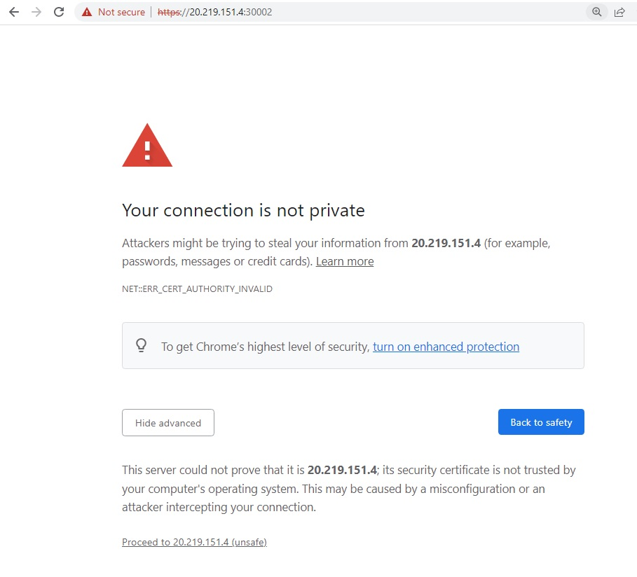
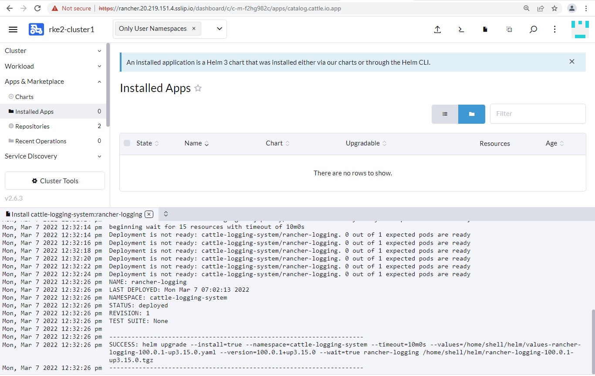
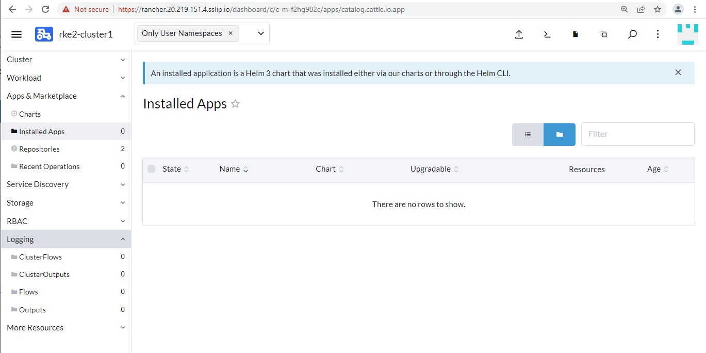
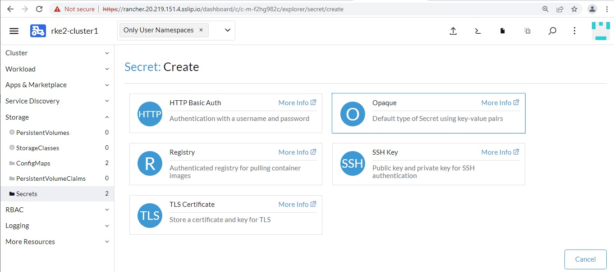

# EFK stack integration with Rancher

As a part the workshop we have deployed SUSE Rancher Server, Keycloak and EFK Stack for you.

The credentails for accessing above environemnt has been emailed to you on your registered email address which you have provided during workshop reistration.

## Rancher Logging using EFK Stack

By now we know that the Keycloak users have very little access to the Rancher platform

Lets verify the if Elastic search engine is up and running, view the elastic search URL and login with "elastic" user and credentials

Now lets verify the if Kibana service dashboard is up and running, view the kibana  URL and login with "elastic" user and credentials

With this, we have successfully completed integration of Keycloak with Rancher and successfully demonstrated Rancher Roles assignments and RBAC.

In the next section we will showcase EFK stack integration with SUSE Rancher.

