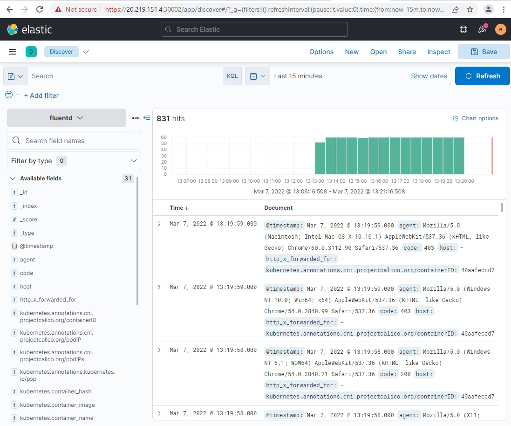

## View Logs using Kibana Dashboard

In this **Exercise-7**, we will view the logs using Kibana dashboard.

### Connecting to Kibana Dashboard

Open lab-credentials file 

Look for keyword **"kibana_url"**, **"elastic_user"** and **"elastic_password"** 

Copy and past Kibana URL link in your favourite browser.

Kibana URL = **"kibana_url"**

user = **elastic**

password = **"elastic_password"**

Navigate below path for creating Index Pattern

Home> Management >  Stack Management > Kibana > Index Patterns

Create **Index Pattern**

Name = **fluentd**

Timestap field = **@timestamp**

Click on **'Create Index Pattern'**

To view the logs, navigate the below path 

Home > Analytics

Click **Discover**

To filter the logs further, you choose below fields

Available fields > click on **'+'** symbol besides the field name

1. **Kubernetes.pod_name**
2. **Agent**

We will see reduced data stream & logs from the pod

With this, we have successfully completed **Rancher Logging and integration with EFK Stack**.

This brings us to end of the Workshop.

We hope you found this technical hands-on workshop informative and helpful.

Form SUSE Team, it was pleasure hosting this workshop.